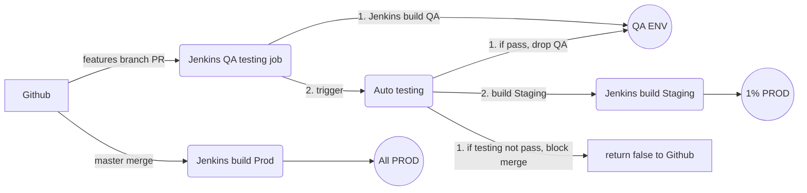

# ECS-CICD

Simple CI/CD pipeline base on AWS ECS.

### Logic diagram:

### Requirment

- AWS [Infrastructure](Infrastructure/)

- Github: integrate Github with Jenkins by Github App or webhook.

- Jenkins server: [Job code](CICD/qa_testing.groovy), Jenkinsfile can be saved in independent Repo, like [this](example/Jenkinsfile).

### TOGO

- Not finish yet

- Keep terraform state on remote backend

- Need grayscale releasing pipeline

- Need approval process

### Reference resources

[Log filter and alarm](https://github.com/terraform-aws-modules/terraform-aws-cloudwatch/tree/master/examples/complete-log-metric-filter-and-alarm)